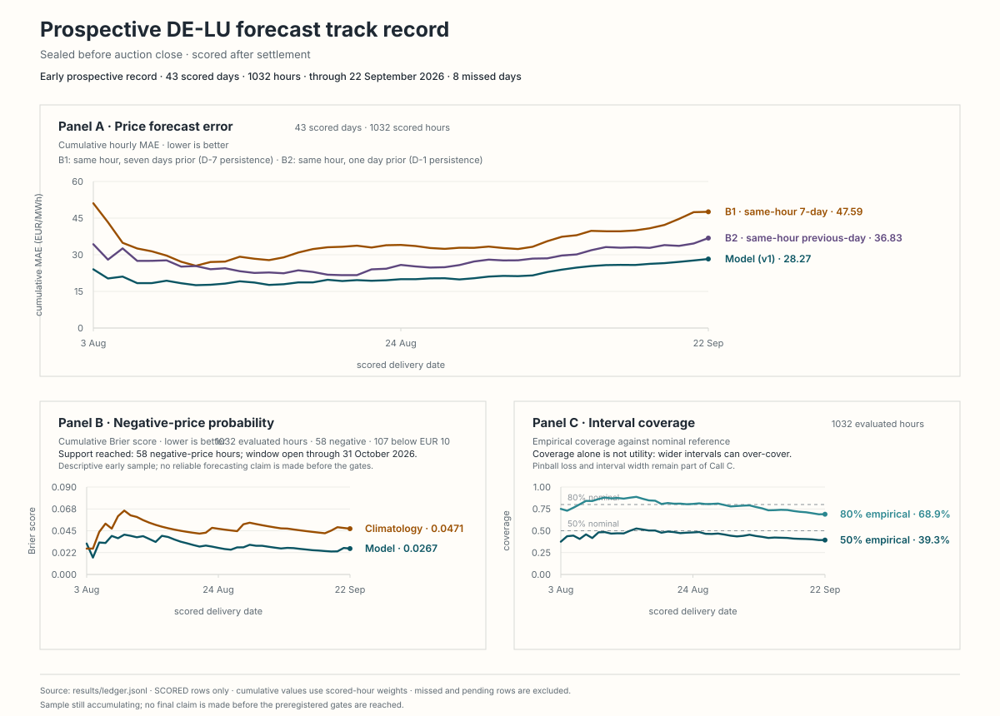

# Live day-ahead forecasting track record: DE-LU power

A forecast published **before** the day-ahead auction closes, scored **after** it
settles, with the commit history as the evidence that the two happened in that
order.

Backtests allow model choices to be influenced by outcomes already present in
the historical data. This repository instead records forecasts prospectively,
before the outcomes are available, so the commit history establishes the
sequence.

Every trading day the system:

1. pulls forward weather and realised market history, hashing every payload;
2. produces a forecast for the next delivery day, sealed with a UTC timestamp;
3. commits it before 12:00 Europe/Berlin, when the auction gate closes;
4. scores it against outturn once settled, appending to a public ledger it can
   never edit backwards.

**Read [`PREREGISTRATION.md`](PREREGISTRATION.md) first.** It is frozen as of the
first sealed prediction and defines the three calls being made, what counts as a
null, and what is explicitly not being claimed.

---

## What is being claimed, and what is not

Three calls are pre-registered:

| Call | Target | Success criterion |
|---|---|---|
| **A** | Hourly day-ahead price level | Positive MAE skill vs same-hour-last-week, 95% block-bootstrap CI excluding zero |
| **B** | Hours clearing below 0 EUR/MWh | PR-AUC beats an hour-of-day/month climatology, CI excluding zero |
| **C** | 50% and 80% prediction intervals | Empirical coverage within 5pp of nominal at both levels |

**No tradeable edge is claimed.** Calls A and B compare against naive and
climatological baselines, not against the market's own expectation. Beating
same-hour-last-week persistence is a statement about persistence, not about the
market. No P&L is simulated or implied anywhere in this repository.

A null on all three is a possible outcome and would be reported as such. The
intended contribution is the prospective record, regardless of the result.

## Current prospective record

[](results/README.md)

*Forecasts are sealed before auction close and outcomes are scored after settlement. Metrics use only committed scored rows through the latest scored delivery date; the sample is still accumulating, so no final claim is made before the preregistered gates are reached.*

---

## The look-ahead trap this design exists to avoid

SMARD's published day-ahead forecasts for load, wind, and solar are unavailable
at the required decision time, so they cannot be used as model inputs.

A probe on 2026-08-01 at 10:38 Europe/Berlin, 82 minutes before the auction
closed, found that every SMARD forecast series was populated only through 23:00
of the *current* day. Zero of the next day's 24 hours were available:

```
series                   last populated (Berlin)      D+   tomorrow hrs
----------------------------------------------------------------------
price_da                 2026-08-01T23:00:00+02:00    D+0  0/24
load_fc                  2026-08-01T23:00:00+02:00    D+0  0/24
renewables_fc            2026-08-01T23:00:00+02:00    D+0  0/24
residual_load_fc         2026-08-01T23:00:00+02:00    D+0  0/24
```

SMARD publishes D+1 forecasts only *after* the auction has cleared. Using them
would introduce look-ahead leakage. Because the data arrives later, a historical
backtest could conceal that timing error.

So SMARD is used for history, lags and scoring only. Forward drivers come from
Open-Meteo numerical weather forecasts, which publish a genuine three-day
horizon. The resulting renewables forecast is derived independently rather than
copied from the TSOs' forecasts.

---

## Filter identification

SMARD returns no usable labels in its `meta` block, so the filter IDs were
verified arithmetically against a live payload rather than taken on trust:

```
5097 == 123 + 3791 + 125     renewables fc == wind onshore + offshore + solar
715  == 122 - 5097           residual load fc == load fc - renewables fc
```

Both held exactly (max error 0.01 MW, rounding), pinning `122` as load forecast,
`5097` as total renewables forecast and `715` as residual load forecast. A
widely-cited ID for load forecast, `4359`, was **rejected**: its values sit
around 8 GW, an order of magnitude below German system load.

These identities are re-checked at runtime on every prediction run. A breach
aborts the run rather than letting a relabelled series reach the model.

---

## Calibration

Raw XGBoost quantile regression was overconfident: the first walk-forward check
returned 0.67 empirical coverage at a nominal 0.80, and 0.37
at a nominal 0.50 — both far outside the ±5pp band call C is judged against.

The intervals use split-conformal calibration instead of a fixed widening
constant selected on the evaluation data. The last 20% of training data is held
out, never used to fit the quantile model, and used only to measure how far
outside its own interval the model actually lands. Expanding by that measured amount gives
marginal coverage of at least the nominal level under exchangeability:

| Interval | Before | After | Nominal |
|---|---|---|---|
| 80% | 0.671 | 0.831 | 0.800 |
| 50% | 0.371 | 0.529 | 0.500 |

Time series are not exchangeable, so this is an approximation rather than the
finite-sample guarantee the theory offers. Both now err slightly wide, which is
the more conservative direction.

### A reproducibility caveat

Two training runs with identical seeds and inputs produced slightly different
fold MAEs (pooled skill +0.4665 vs +0.4818). The likely cause is non-deterministic
float summation across XGBoost's worker threads. This does not affect any claim
made here: predictions come from the **frozen artefacts**, whose SHA-256 hashes
are recorded in `models/v1/MANIFEST.json` and in every sealed prediction. Exact
re-training reproducibility is a separate and weaker property than prediction
reproducibility, and only the latter is relied on.

## Integrity mechanisms

- `predictions/` is **write-once**; CI fails the build if an existing file there
  is modified or deleted.
- Predictions are generated by scheduled GitHub Actions, so commit timestamps
  are GitHub's, not a local clock.
- Scoring is a separate job that only ever appends to `results/`.
- Every input payload is SHA-256 hashed into the sealed prediction.
- A failed run is recorded as `MISSED` and **cannot be backfilled**. The final
  report states the missed-day count.

---

## Layout

```
PREREGISTRATION.md     frozen before the first prediction
src/de_power_live/
  smard.py             SMARD client, runtime identity checks
  weather.py           Open-Meteo client, turbine power curve, national drivers
predictions/           write-once sealed forecasts
results/               append-only scoring ledger
models/                frozen model artefacts and manifests
.github/workflows/     scheduled predict / score / integrity jobs
```

## Running locally

```bash
python -m venv .venv
.venv/Scripts/Activate.ps1        # PowerShell
python -m pip install -e ".[dev]"
pytest
```

---

Author: Jacob Mackey · [jacobmackey.com](https://jacobmackey.com) · MIT licensed.
